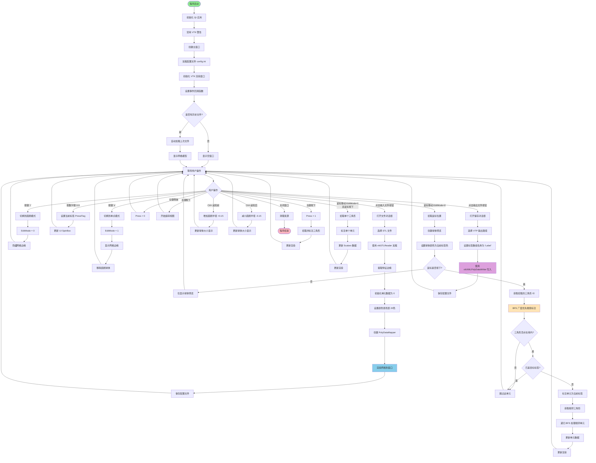
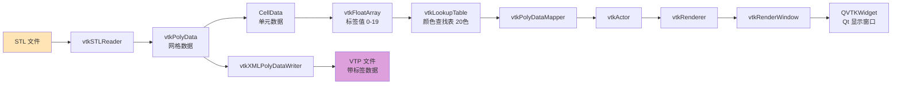
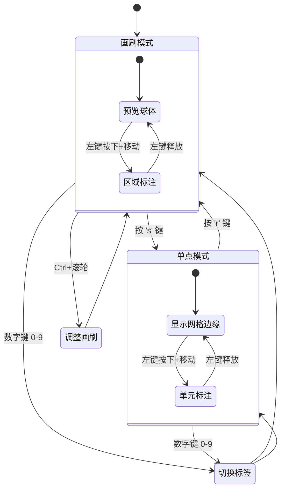
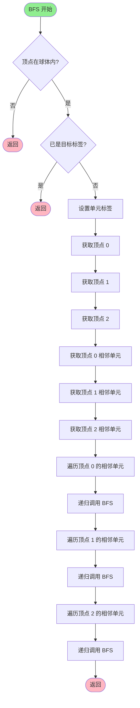

# MeshLabeler 项目流程图

## 项目概述
MeshLabeler 是一个基于 Qt 和 VTK 的 3D 网格标注工具,支持 STL/PLY/OBJ 格式的网格文件标注。

## 主要流程图



## 数据结构流程



## 用户交互模式



## 核心算法：BFS 区域标注



## 配置文件结构

```
[path]
INPUT_FILE_NAME=上次打开的输入文件路径.stl
OUTPUT_FILE_NAME=上次保存的输出文件路径.vtp
LAST_OPEN_PATH=上次访问的目录路径
```

## 快捷键说明

| 按键 | 功能 |
|------|------|
| 0-9 | 选择标签编号 (0-9) |
| s | 切换到单点标注模式 |
| r | 切换到画刷标注模式 |
| 左键 | 标注网格单元 |
| 右键拖拽 | 旋转视图 |
| Ctrl + 滚轮↑ | 增大画刷半径 |
| Ctrl + 滚轮↓ | 减小画刷半径 |
| 滚轮 | 缩放视图 |

## 技术栈

- **UI 框架**: Qt 5/6
- **3D 渲染**: VTK (Visualization Toolkit)
- **支持格式**:
  - 输入: STL, PLY, OBJ
  - 输出: VTP (VTK XML PolyData)
- **构建系统**: qmake (.pro 文件)
